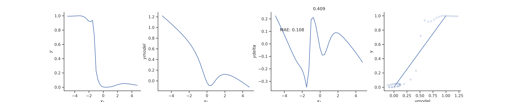
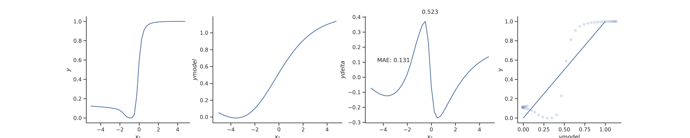

| Goal | Notes | 
| ----------- | ----------- |
|(W)| |
|(PH)|Send email to T and F; check calculations; introduce whatever corrections seem reasonable |
|(R)|Papers Marc and Oscar; Review |
|(ANN)|Check processes and see if everything is done until dataid=3 |
|(O)|Meeting with Toni |

## April 8

**ANN** I want to prepare a short report on what I have been doing about the ANN project.

If the BMS does not get stuck many times, I might have DATAID=3 ready for Wednesday. I have three processes going on right now. 11 to 14, 15 to 17, and 18 to 19 . Even if something gets stuck, there is margin to re-run processes tomorrow. However, I still need to to the proper analysis.

Tomorrow:

Block 1 - Re-run the notebook for DATAID=0 and see the results. Is it worth it to embed the figures into your notebook? Even if it helps yourself make sense of the results?
	   Do a DATAID=1 run

Block 2 - 
	  Paper review. Start where you left it.
      	  Finish tables in your report

Block 3 - T and F's email. Answer the questions
      	  Re-do calculations.

**R** Review

In a co-occurrence network, I would expect that two strains are connected if they are equally abundant.
      	
## April 9

**O** 
I will need to reformulate the final paragraph.
The grant asks to explicitly assess the following ideas:
adaptability: (to what?)
applicability: to me this means applying the method to the real world with the challenges faced by air controlers. We have this theoretically covered)
viability: Is this idea feasible. Yes.
Innovation: This is justified with the second paragraph
Operational impact: I think this could be the usual "impact" of a grant.

Too many things at once.

Block 1 - 
      	  PySr for dataid=1,2, and maybe 3
	  Finish tables of runs
	  Think

Block 2 - Think about meeting
      	  Paper review

Block 3 - Email and calculations

Block 4 - Think about meeting

## April 10

**ANN** Project summary.

### Introduction

I finished traces for the BMS in one dimension for $$DATAID =  0,1,2$$. For each dataset, I generated 20 traces. I am still running $$DATAID = 3$$.
I used a modified version of the code 'sample_single.py' for one-dimensional data. This code runs 50000 steps of the BMS and stops afterwards.
The code takes data with the following settings:

$$ILS = 2$$ - Initial Layer Size
$$NL=5$$ - Number of layers
$$LS=10  - Layer Size
Data generated for $$x=[-5,5]$$. 40 points.

I used the prior file 'final_prior_param_sq.named_equations.nv1.np10.2017-10-18 18:07:35.089658.dat'. My understanding is that this file sets the prior to 10 parameters?

I noticed two technical issues while generating the traces: first, the BMS gets stuck in many instances. This would be an interesting problem to tackle. Second, the MDL increases instead of decreasing.
Below, I show tables for the data generated with the trend, MDL at the beginning and end of the process, and number of steps.

### Information about runs of traces

|Dataid|Runid| Trend  | MDL                     | Steps |
| ---- | --- | ------ |-------------------------|------ |
|   0  |  0  |  Up    |20.294781 57.268934 | 49999 |
|   0  |  1  |  Down  |20.294781 9.069446  | 47474 |
|   0  |  2  |  Up    |25.660849 77.879671 | 49999 |
|   0  |  3  |  Down  |20.294781 -28.965687| 49999 |
|   0  |  4  |  Down  |20.294781 -67.018353| 3720  |
|   0  |  5  |  Up    |20.294781 65.488852 | 49999 |  
|   0  |  6  |  Up    |23.974728 211.3611  | 49999 |	  
|   0  |  7  |  Up    |20.294781 192.837103| 49999 |	  
|   0  |  8  |  Up    |20.294781 31.069555 | 49999 |	  
|   0  |  9  |  Up    |20.294781 152.280483| 49999 |
|   0  | 10  |  Up    |20.294781 32.910901 | 49999 |
|   0  | 11  |  Up    |20.294781 161.748298| 49999 |
|   0  | 12  |  Down  |20.294781 -29.377455| 49999 |
|   0  | 13  |  Up    |23.992715 148.358166| 49999 |
|   0  | 14  |  Up    |25.027049 33.581254 | 49999 |
|   0  | 15  |  Up    |20.294781 86.598311 | 49999 |
|   0  | 16  |  Up    |20.294781 146.491785| 49999 |
|   0  | 17  |  Down  |20.294781 13.824629 | 49999 |
|   0  | 18  |  Up    |20.294781 115.226628| 49999 |
|   0  | 19  |  Up    |20.294781 193.571991| 49999 |

|Dataid|Runid| Trend  | MDL                     | Steps |
| ---- | --- | ------ |-------------------------|------ |
|   1  |  0  |  Up    |28.931262 261.07662      | 49999 |
|   1  |  1  |  Down  |28.931262 -0.833894  	| 6324  |
|   1  |  2  |  Up    |28.931262 151.835267 	| 49999 |
|   1  |  3  |  Up    |28.931262 163.623833 	| 49999 |
|   1  |  4  |  Up    |37.995265 82.429045  	| 49999 |
|   1  |  5  |  Up    |28.931262 98.223109  	| 49999 |
|   1  |  6  |  Up    |28.931262 194.105650 	| 49999 |
|   1  |  7  |  Up    |36.575994 235.663349 	| 49999 |
|   1  |  8  |  Down  |28.931262 22.224269  	| 49999 |	  
|   1  |  9  |  Up    |28.931262 362.259561 	| 49999 |
|   1  | 10  |  Up    |28.931262 149.727488 	| 49999 |
|   1  | 11  |  Up    |33.443178 59.31554   	| 49999 |
|   1  | 12  |  Up    |28.931262 50.640794  	| 49999 |
|   1  | 13  |  Up    |32.629197 41.680697  	| 49999 |
|   1  | 14  |  Up    |28.931262 67.780763  	| 49999 |
|   1  | 15  |  Up    |28.931262 258.645669 	| 49999 |
|   1  | 16  |  Up    |28.931262 60.205036 	| 49999 |
|   1  | 17  |  Up    |28.931262 210.232905 	| 49999 |
|   1  | 18  |  Down  |28.931262 11.53312   	| 49999 |
|   1  | 19  |  Up    |28.931262 130.453526 	| 19713 |

|Dataid|Runid| Trend  | MDL                     | Steps |
| ---- | --- | ------ |-------------------------|------ |
|   2  |  0  |  Up    | 27.76239   79.998659  | 49999 |
|   2  |  1  |  Up    | 27.76239   97.016372  | 49999  |
|   2  |  2  |  Down  | 27.762390 -49.434129  | 49999 |
|   2  |  3  |  Up    | 27.76239  171.725695  | 49999 |
|   2  |  4  |  Down  | 27.76239   -7.080423  | 49999 |
|   2  |  5  |  Up    | 27.76239    56.501876 | 49999 |
|   2  |  6  |  Up    | 27.762390     7.893359| 49999 |
|   2  |  7  |  Up    | 27.76239    166.319251| 49999 |

|   2  |  8  |  Down  |28.931262 22.224269 | 49999 |	  
|   2  |  9  |  Up    |28.931262 362.259561| 49999 |
|   2  | 10  |  Up    |28.931262 149.727488| 49999 |
|   2  | 11  |  Up    |33.443178 59.31554  | 49999 |    
|   2  | 12  |  Up    |28.931262 50.640794 | 49999 |
|   2  | 13  |  Up    |32.629197 41.680697 | 49999 |
|   2  | 14  |  Up    |28.931262 67.780763 | 49999 |
|   2  | 15  |  Up    |28.931262 258.645669| 49999 |
|   2  | 16  |  Up    |28.931262 60.205036 | 49999 |
|   2  | 17  |  Up    |28.931262 210.232905| 49999 |
|   2  | 18  |  Down  |28.931262 11.53312  | 49999 |
|   2  | 19  |  Up    |28.931262 130.453526| 49999 |

### Results

#### $$Dataid=0$$

$$MAE=0.001$$

Model: 5 parameters, 2 linear terms

The oscillations of the error are probably due to the model switching from underperforming to overperforming. Oscillations increase in amplitude between $$x_1=[0,3]$$. Is this because the model does not predict accurately the drop of the sigmoidal function?

Pysr results

$$MAE=0.121$$ Two orders of magnitude higher than BMS.

Taking maximum description length:

#### $$Dataid=1$$

$$MAE=0.019$$

Model: 4 parameters, 2 linear terms (one constant)

Taking maximum description length: $$MAE=0.0168$$

#### $$Dataid=2$$

$$MAE=0.0004$$
$$MDL=-106.744276607185$$
Model: 7 parameters, 1 term

**ANN** What does the pyreen thing do? At least it builds neural networks.
You can also train neural networks (to predict/explain data?)

The goal is to generate 10 neural networks with identical architecture but different weight adjustments. In one dimension. And with relu as a function.
Then you train those neural networks with another neural network? And see if you recover the original data. But how do you validate the predictions?

In his code, this is what happens:
1. Read a dataset of ~150000 points and 7 independent variables.
2. Train with 50000 points, test on 100000 points.
3. Initialize a neural network
4. Train that neural network with your train set
5. Then you plot the predictions against the train and test set.

Questions:
How does an ANN work? Where are the weights and the tanh function?
What does it mean to train an ANN?

It is probably a good idea to read the documentation.

$$MAE=0.139, 0.131$$

**ANN**
Rashomon set. I think this is having a set of expressions or models explaining the same dataset in the training set, but not out of sample.
Questions: do ANNs predict better or worse than the BMS?
	   How many mathematical equations can explain the same dataset?
	   How do you define similar models? Is it the mathematical expression or the predictions inside the training set and/or the training set?
	   How do you define a metric to measure model similarity? The MDL does not do the trick. Is it the same problem that a sort of shannon entropy could solve?
	   Is there a tipping point where the number of models that explain the same data explodes?
	   How is noise related to this problem?
	   
**O** I think I need some rules to prevent physical and mental barriers to perform adequately. One of those rules is that this notebook should be easily identifiable: maybe I could color the window or locate the window at a specific desktop.
I am thinking of assigning sections of the ELN to specific projects. However, I am worried that defeats the purpose or applicability of the ELN. After the meeting today, I should be able to assess that after the meeting. If we have biweekly meetings, maybe it makes sense to produce a report. In any case, building a small report is a good idea.

There are several things I feel I should be doing now:
1. Learn more about rashomon sets.
2. Think about the project. How would I go on if I were on my own.
3. Think about specific tasks that I would perform.
4. Finish table and figures with maximum H.
This task would be useful and overlaps with #2.

How would I move on with this project if I were on my own? I think I would be interested in the Rashomon set problem.
How many equations and/or models can explain the same dataset? "The Rashomon set is the set of these all almost-optimal models."

Suppose that I give you some observed data in two dimensions in a subset of the space.
Now take all models (or a distribution thereof) that explain that observed data with an error smaller than $$\epsilon$$.
Then I look at what happens out of sample. I might get groups of expressions that have similar expressions. Because "out of sample" is arbitrary, I could keep extending the out-of-sample subset and the groups would become smaller.
What if I could go to infinite. Maybe, after a number of iterations, I would be getting the same groups, after all.
This would tell me that there are certain expressions that, despite being different, have the same or very similar fenotypes. What about the genotypes?
Suppose you call the expressions of equations "genotypes". However, two different genotypes might display the same phenotypes. If that happens, are the genotypes equivalent (do they have the same meta-genotype)?

Another question is how do you measure the similarity of expressions. To measure the similarity of phenotypes, you use the rashomon set, but what about the genotype?
The MDL is probably not enough. There can be infinite expressions with the same MDL, just as there are many computer programs with the same number of bits. How would you tell one from another in a way that matters?

Is it possible that there is a universal meta-genotype for all expressions with the same phenotype. Is it possible that functions have alternative expressions just as it happens with taylor expressions?

**O** A presentation about fertilizers and their importance.
How would I make that?
Fertilizers are important because they sustain half of the world population. And they are limited and energy consuming. That is a huge mistake on the long run. That is because the production of fertilizers is energy-dependent and supplies are limited.
Justus von Liebig realizes that N-P-K matter a lot for agriculture. He comes with the law of the minimum. Maybe that's why carbon appears to be not that important.
Why are they important?
Humankind starts exploiting P reserves: human bones, guano, P reserves (Western Sahara)
Haber process: mix agriculture with fossil fuels.
1 calorie obtained per 1 calorie input.
US and corn. What is special about corn?
They stop rotating crops. Monocrops are bad for several reasons.
Roosevelt creates a system where you could get money from exceptionally good harvests.
Nixon breaks the deal and subsidizes over-production of corn. What do you with that corn?
HFCS, feed animals, biofuels.
Pesticides, Rachel Carson and DDT.
Talk about haber as a scientific figure.

**ANN** In pyrenn there are three parameters for an ANN.
Input layer with R inputs
M-1 hidden layers
Output layer with S^m.

Each neuron recieves n p inputs. Each input has a weight.
First the neuron takes the sum of the inputs multiplied by the weights, then adds a bias and then that becomes the input (n) of transfer functions.

Block 1 - Paper review
          Keep reading where you left it (at least three pages)
	  Fill questionnaire (with approximate assessments)
	  Start drafting a decision

Block 2 - Can you build a neural network with a desired transfer function in pyrenn?
      	  Can you tune the weights?
	  If not, what choices would you have?
	  Clean folder

Block 3 - T and F email. Keep drafting responses.
      	  Double check calculations.
	  Think

Block 4 - Think about ANNs

## April 11

Tomorrow:
Block 1 - Finish review
Block 2 - ANN reading and tests (see Block 2 for today)
Block 3 - Reading - Phosphate