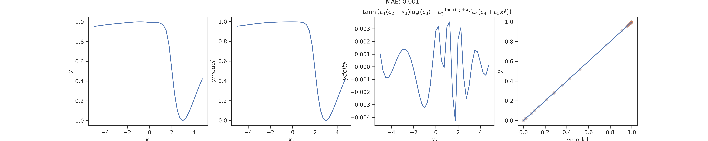
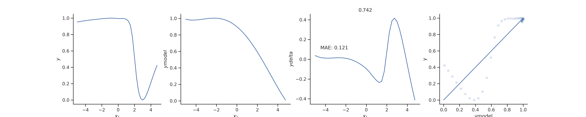
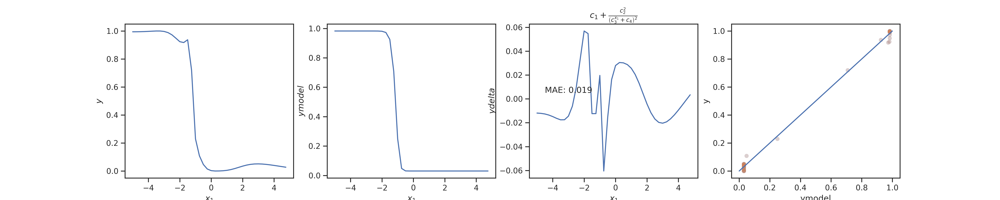
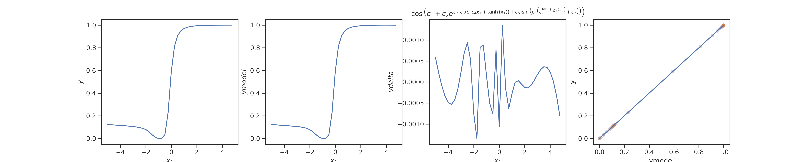

| Goal | Notes | 
| ----------- | ----------- |
|(W)| |
|(PH)|Send email to T and F; check calculations; introduce whatever corrections seem reasonable |
|(R)|Papers Marc and Oscar; Review |
|(ANN)|Check processes and see if everything is done until dataid=3 |
|(O)|Meeting with Toni |

## April 8

**ANN** I want to prepare a short report on what I have been doing about the ANN project.

If the BMS does not get stuck many times, I might have DATAID=3 ready for Wednesday. I have three processes going on right now. 11 to 14, 15 to 17, and 18 to 19 . Even if something gets stuck, there is margin to re-run processes tomorrow. However, I still need to to the proper analysis.

Tomorrow:

Block 1 - Re-run the notebook for DATAID=0 and see the results. Is it worth it to embed the figures into your notebook? Even if it helps yourself make sense of the results?
	   Do a DATAID=1 run

Block 2 - 
	  Paper review. Start where you left it.
      	  Finish tables in your report

Block 3 - T and F's email. Answer the questions
      	  Re-do calculations.

**R** Review

In a co-occurrence network, I would expect that two strains are connected if they are equally abundant.
      	
## April 9

**O** 
I will need to reformulate the final paragraph.
The grant asks to explicitly assess the following ideas:
adaptability: (to what?)
applicability: to me this means applying the method to the real world with the challenges faced by air controlers. We have this theoretically covered)
viability: Is this idea feasible. Yes.
Innovation: This is justified with the second paragraph
Operational impact: I think this could be the usual "impact" of a grant.

Too many things at once.

## April 10

**ANN** Project summary.

### Introduction

I finished traces for the BMS in one dimension for $$DATAID =  0,1,2$$. For each dataset, I generated 20 traces. I am still running $$DATAID = 3$$.
I used a modified version of the code 'sample_single.py' for one-dimensional data. This code runs 50000 steps of the BMS and stops afterwards.
The code takes data with the following settings:

$$ILS = 2$$ - Initial Layer Size
$$NL=5$$ - Number of layers
$$LS=10  - Layer Size

I used the prior file 'final_prior_param_sq.named_equations.nv1.np10.2017-10-18 18:07:35.089658.dat'. My understanding is that this file sets the prior to 10 parameters?

I noticed two technical issues while generating the traces: first, the BMS gets stuck in many instances. This would be an interesting problem to tackle. Second, the MDL increases instead of decreasing.
Below, I show tables for the data generated with the trend, MDL at the beginning and end of the process, and number of steps.

### Information about runs of traces

|Dataid|Runid| Trend  | MDL                     | Steps |
| ---- | --- | ------ |-------------------------|------ |
|   0  |  0  |  Up    |20.294781 57.268934 | 49999 |
|   0  |  1  |  Down  |20.294781 9.069446  | 47474 |
|   0  |  2  |  Up    |25.660849 77.879671 | 49999 |
|   0  |  3  |  Down  |20.294781 -28.965687| 49999 |
|   0  |  4  |  Down  |20.294781 -67.018353| 3720  |
|   0  |  5  |  Up    |20.294781 65.488852 | 49999 |  
|   0  |  6  |  Up    |23.974728 211.3611  | 49999 |	  
|   0  |  7  |  Up    |20.294781 192.837103| 49999 |	  
|   0  |  8  |  Up    |20.294781 31.069555 | 49999 |	  
|   0  |  9  |  Up    |20.294781 152.280483| 49999 |
|   0  | 10  |  Up    |20.294781 32.910901 | 49999 |
|   0  | 11  |  Up    |20.294781 161.748298| 49999 |
|   0  | 12  |  Down  |20.294781 -29.377455| 49999 |
|   0  | 13  |  Up    |23.992715 148.358166| 49999 |
|   0  | 14  |  Up    |25.027049 33.581254 | 49999 |
|   0  | 15  |  Up    |20.294781 86.598311 | 49999 |
|   0  | 16  |  Up    |20.294781 146.491785| 49999 |
|   0  | 17  |  Down  |20.294781 13.824629 | 49999 |
|   0  | 18  |  Up    |20.294781 115.226628| 49999 |
|   0  | 19  |  Up    |20.294781 193.571991| 49999 |

|Dataid|Runid| Trend  | MDL                     | Steps |
| ---- | --- | ------ |-------------------------|------ |
|   1  |  0  |  Up    |28.931262 261.07662      | 49999 |
|   1  |  1  |  Down  |28.931262 -0.833894  	| 6324  |
|   1  |  2  |  Up    |28.931262 151.835267 	| 49999 |
|   1  |  3  |  Up    |28.931262 163.623833 	| 49999 |
|   1  |  4  |  Up    |37.995265 82.429045  	| 49999 |
|   1  |  5  |  Up    |28.931262 98.223109  	| 49999 |
|   1  |  6  |  Up    |28.931262 194.105650 	| 49999 |
|   1  |  7  |  Up    |36.575994 235.663349 	| 49999 |
|   1  |  8  |  Down  |28.931262 22.224269  	| 49999 |	  
|   1  |  9  |  Up    |28.931262 362.259561 	| 49999 |
|   1  | 10  |  Up    |28.931262 149.727488 	| 49999 |
|   1  | 11  |  Up    |33.443178 59.31554   	| 49999 |
|   1  | 12  |  Up    |28.931262 50.640794  	| 49999 |
|   1  | 13  |  Up    |32.629197 41.680697  	| 49999 |
|   1  | 14  |  Up    |28.931262 67.780763  	| 49999 |
|   1  | 15  |  Up    |28.931262 258.645669 	| 49999 |
|   1  | 16  |  Up    |28.931262 60.205036 	| 49999 |
|   1  | 17  |  Up    |28.931262 210.232905 	| 49999 |
|   1  | 18  |  Down  |28.931262 11.53312   	| 49999 |
|   1  | 19  |  Up    |28.931262 130.453526 	| 19713 |

|Dataid|Runid| Trend  | MDL                     | Steps |
| ---- | --- | ------ |-------------------------|------ |
|   2  |  0  |  Up    |  | 49999 |
|   2  |  2  |  Down  |  | 6324  |
|   2  |  2  |  Up    |  | 49999 |
|   2  |  3  |  Up    |28.931262 163.623833| 49999 |
|   2  |  4  |  Up    |37.995265 82.429045 | 49999 |
|   2  |  5  |  Up    |28.931262 98.223109 | 49999 |
|   2  |  6  |  Up    |28.931262 194.105650| 49999 |
|   2  |  7  |  Up    |36.575994 235.663349| 49999 |
|   2  |  8  |  Down  |28.931262 22.224269 | 49999 |	  
|   2  |  9  |  Up    |28.931262 362.259561| 49999 |
|   2  | 10  |  Up    |28.931262 149.727488| 49999 |
|   2  | 11  |  Up    |33.443178 59.31554  | 49999 |    
|   2  | 12  |  Up    |28.931262 50.640794 | 49999 |
|   2  | 13  |  Up    |32.629197 41.680697 | 49999 |
|   2  | 14  |  Up    |28.931262 67.780763 | 49999 |
|   2  | 15  |  Up    |28.931262 258.645669| 49999 |
|   2  | 16  |  Up    |28.931262 60.205036 | 49999 |
|   2  | 17  |  Up    |28.931262 210.232905| 49999 |
|   2  | 18  |  Down  |28.931262 11.53312  | 49999 |
|   2  | 19  |  Up    |28.931262 130.453526| 49999 |

### Results

$$Dataid=0$$

$$MAE=0.001$$

5 parameters
2 linear terms

The oscillations of the error are probably due to the model switching from underperforming to overperforming. Oscillations increase in amplitude between $$x_1=[0,3]$$. Is this because the model does not predict accurately the drop of the sigmoidal function?

$$MAE=0.121$$ Two orders of magnitude higher than BMS.

$$Dataid=1$$

$$MAE=0.019$$

4 parameters
2 linear terms (one constant)

$$Dataid=2$$

$$MAE=0.0004$$
7 parameters
1 term

