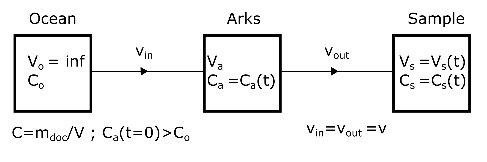
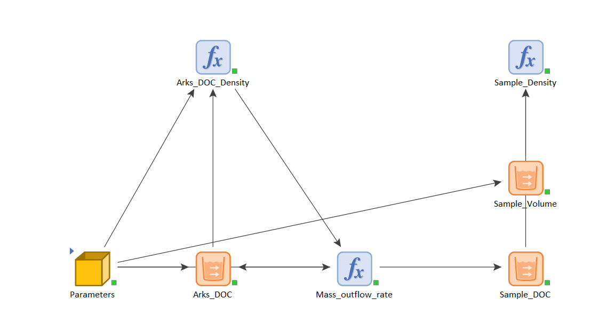
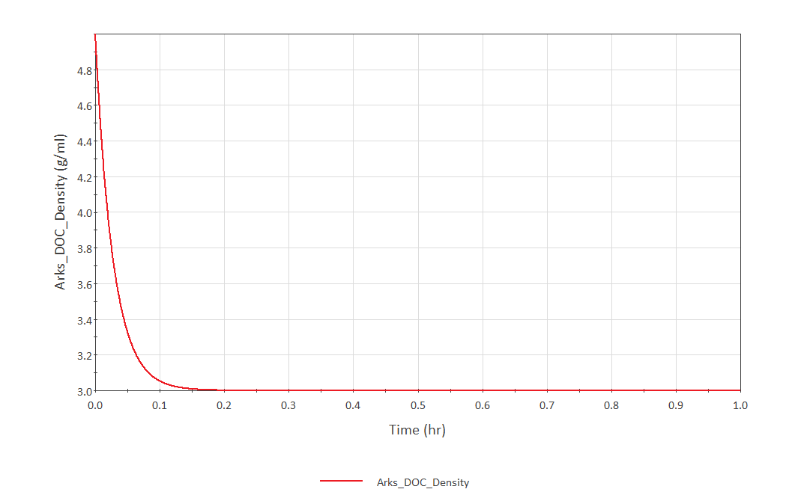
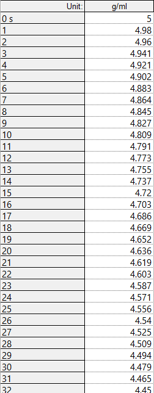
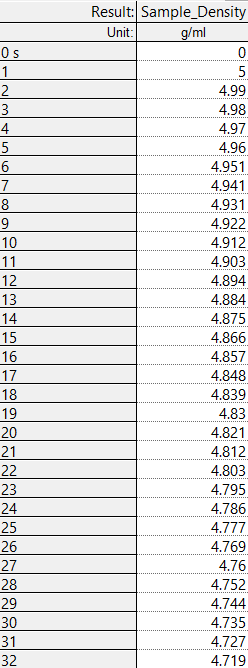

| Goal | Notes |
| ----------- | ----------- |
|(PH)| Find conditions of quasiequilibrium, hypothesis for O2 vs phages, and review for ESA|
|(MS)| How to do salinity and find an equation |
|VP| Send draft to Heather and Brieenn|
|Hyperion (H)| Review figures and text (how?) |
|Reading (R)| Read Origin, Reading the rocks, and Transient dynamics|
|Others (O)| Find datasets for O2 vs Temperature, and look at the literature |

## February 6

**CP** - I was preparing the class for the classics yesterday

## February 7

VP -  I am going to re read my draft and will read the paper from Cynthia and Forest.

**O** - Help Jenna with problem for the Arks
This is being a more difficult problem than I expected. Right now, I am thinking I should think in terms of mass rather than in terms of volume and or concentration.
I have three elements: ocean, arks, and sample. I need to understand what is happening in the arks and then everything should go better.
Let $$V_a$$ be the volume of the arks. Let $$V_a$$ be constant, which means that water flows in and out at the same flow rate ($$v_{in}=v_{out}$$)

$$
\begin{equation*}
\frac{d V_a}{dt} = -v_{out} + v_{in} = 0
\end{equation*}
$$

For simplicity, I am going to assume that $$v_{in}=v_{out}= 1 ml/s$$. I am going to assume also that the initial concentration of DOC in the Arks is $$\rho_A(t=0)=5g/ml$$ and that the concentration in the ocean is constant and
$$\rho_O=3g/ml$$. Now, the change of volume per se does not tell me anything, but it should tell me how the concentration and the mass of DOC changes in the arks. The volume is a proxy for the
mass of DOC. As a first approximation:

$$
\begin{equation*}
\frac{d M_a}{dt} = -\rho_a(t) v_{out} + \rho_o v_{in}
\end{equation*}
$$

The concentration of DOC in the arks \rho_a is a function of time because as ocean water enter the system, it dilutes the concentration. How do I calculate this function? It is just the
mass at time t divided by the volume (constant):

$$
\begin{equation*}
\frac{d M_a}{dt}= - \frac{M_a(t)}{V_a} v_{out}   + \rho_o {v_in} 
\end{equation*}
$$

## February 8

**VP** - I read the abstract of the paper of Cynthia and Forest. Now I am going to read my draft and decide what could be better or different:
1. Abstract - I think I should start telling what exactly I am doing. Then, I can justify why I am doing that. I have a first version ready.
The next goal will be to look at the introduction.

**O** - Concentrations of DOC in the arks. I though about it yesterday, and I figured out I have to think in terms of mass of DOC, rather than volume or concentration. 

Statement of the problem:

Suppose that the concentration of DOC in the arks at t=0 is larger than the concentration of DOC in the ocean: $$c_a(t=0)>c_o$$. The volume of water in the arks does not change, 
but there is an outflow from Arks (A) to the Sample (S) and an inflow from the ocean (O) to A:

$$
\begin{equation*}
\frac{d V_a}{dt} = -v_{out} + v_{in} = 0
\end{equation*}
$$

This equation is not informative in itself. However, the water inflows and outflows carry different concentrations (and masses) of DOC. 
Let us look at rate of the mass of DOC in the arks ($$M_a$$):

$$
\begin{equation*}
\frac{d M_a}{dt} = -c_a(t) v_{out} + c_o v_{in}
\end{equation*}
$$

where $$c_a(t)$$ and $$c_o$$ represent the concentration of DOC in the arks and in the ocean, respectively. Note that $$c_a$$ is a function of time, because the water in the arks is 
being diluted over time. Because the volume of the arks $$V_a$$ is constant, getting the concentration of DOC is straightforward ($$c_a(t) = M_a(t)/V_a$$).

Regarding the sample, we know that:

$$
\begin{align*}
\frac{d M_s}{dt} &=& c_a(t) v_{out} \\
\frac{d V_s}{dt} &=& v_{out}
\end{align*}
$$

Now, to illustrate the model with an example, let us suppose that:

1. $$V_a=100 ml$$
2. $$c_a(0)=5 g/ml$$
3. $$c_o=3 g/ml$$
4. $$v_{in}=v_{out}=1 ml/s$$
5. $$V_a =100 ml $$
6. $$m_a= c_a(0), V_a = 500 g$$

Assuming that the timestep of the model is 1 second, we would expect our model to give the following results:

| t(s) | $$M_a (g)$$ |  $$c_a (g/ml)$$ | $$M_s (g)$$ | $$c_s (g/ml)$$ |
| ---- | ----------- | ----------- |----------- | ----------- |
|0| 500   | 5    | 0 | 0 |
|1| 498   | 4.98 | 5 | 5 |
|2| 496.02| 4.96 | 9.98 | 4.99 |
|3| 494.1 | 4.94 | 14.94 | 4.98 |
|4| 492.12| 4.92 | 19.88 | 4.97 |
|5| 490.2 | 4.90 | 24.8 | 4.96 |

This is the model in GoldSim:

DOC density in the arks over time:

Table format:

The numbers are consistent with the table above.

DOC Density in the sample over time:

The numbers are consistent with the table above.

## February 9

**CP** - I read an analysis of chapter XI of the Origin of species. It looks to me that it starts getting redundant. What is Darwin trying to do here? Is he maybe acknowledging things that he does not
know (he says that he does not know how extinction works)? Is he combining what he was explaining about the fossil record with the first chapters about natural selection and the struggle of existence?
Or is he simply trying to show how he thinks extinction occurs based on fossil evidence?

**W** - Hyperion. My plan for today is to:
1. Think what is this paper about again
2. Read the whole thing and make notes on what needs to be done
3. Set priorities on what to work on between today and tomorrow
4. Start working on figures

1. What is this paper is about:
- Hypothesis: given a dynamical system, if we describe that system mathematically, we will observe that not all the terms are active all the time.
- Terms activate and inactivate over time.
- These activations/inactivations generate regime shifts via tipping points.
- We present a tool to analyze dynamical systems such that we can:
  1. Predict tipping points (and regime shifts)
  2. Prevent tipping points.
  3. Identify conditions of quasi-stability.
  
- We apply our tool to a phage-bacterial system

How do I phrase this in a paper format?

In this work, we present a mathematical tool to predict tipping points that generate regime shifts in transient dynamical systems. Transient dynamics are characterized by transitions between two quasi-stable dynamics.  Our method stems from the hypothesis that in any given dynamical system, not all the terms are active all the time. And that the activation and inactivation of terms is the cause of shifts in the dynamics. As a proof of concept we apply our method to a predator-prey model of bacteria and bacteriophage, the most abundant biological agents on earth. Our method identifies the activation and inactivation of terms in the dynamics, that correspond to tipping points leading to the extinction of bacteria or phage and identifies the conditions of quasi-stability. We show that the condition for quasi-stable dynamics is that the characteristic timescales of bacteria and bacteriophage are comparable. 

**O** - Seminar
-Aiptasia (dinoflagellate). Model organism. Convenient size, soft and hardy, large clonal populations.
Symbiosis can break down upon thermal stress

**O** - Concentrations of DOC in the arks.

$$E$$ - Environment (Ocean)
$$I$$ - Interest (Arks)
$$S$$ - Sample

Volume rate of $$I$$:

$$
\begin{align*}
\frac{d V_I}{dt} &=& 0 \\
\frac{d V_I}{dt} &=& -v_{out} +v_{in} \\
v_{in} &=& v_{out}=v
\end{align*}
$$

Mass rate of $$I$$:

$$
\begin{equation*}
\frac{d M_I}{dt} = -D_I(t) v_{out} + D_E v_{in} 
\end{equation*}
$$

Because $$v_{out}=v_{in}=v$$ and because $$D_I=\frac{M_I}{V_I}$$

$$
\begin{equation*}
\frac{d M_I}{dt} = (D_E - \frac{M_I}{V_I}) v = \frac{v}{V_I}(D_E V_I -M_I)
\end{equation*}
$$

If we reformulate the parameters as $$a=\frac{v}{V_I}$$ and $$b=D_E V_I$$, we get:

$$
\begin{equation*}
\frac{d M_I}{dt} =  a(b -M_I)
\end{equation*}
$$

We can solve this differential equation and get:

$$
\begin{equation*}
M_I(t) =  b + (M_I(0) - b) e^{-at}
\end{equation*}
$$

or in its original form:

$$
\begin{equation*}
M_I(t) = D_E V_I  + (M_I(0) - D_E V_I) e^{-vt/V_I}
\end{equation*}
$$

## February 10

## Results of the week

PH - I was able to solve task a, as I show in the figure.

MS - I solved task b and got these figures that I am showing.

H - I could not finish task c, but I did subtasks c1, c2, and c3. I will do c4 next week.

O - the class was very interesting this week, I could solve my problems with SDSU HR, and sent the submission for conference c
