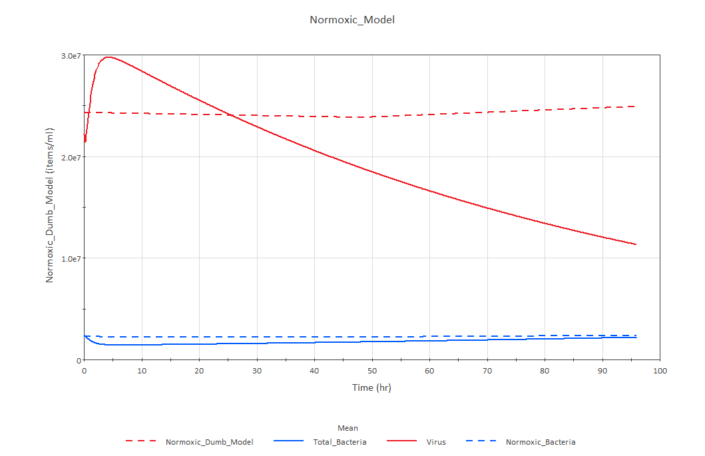

# January

## January 2 to 6

Goals of the week

-Finish GoldSim model
-Finish presentation
-Do bulk part of presentation for Jan 12

Reading
Origin of species
Smart brevity

### January 2
The next thing I want to do is to change concentrations of $$O_2$$ and/or glucose at day 0 (day +2)
There are several types of elements in GoldSim that appear to be helpful.
This is confusing to me: all I need is to change the concentration of $$O_2$$ or glucose at day 2.
Then, I guess I need some element that can do these two instructions. I found how to add 
concentration, but not the timed part.
The event delay is not helpful to me. I might need time series.
I got it now.
I have something that can be functional now. I would need to:
1. Rename this discrete addition.
2. Link it to $$O_2$$ or glucose.
3. Test it again.
4. Repeat until I have all the corresponding experiments implemented.

The sugar part is done. I am going to implement O2. However, I still don't know if these
are single interventions or continuous ones (i.e., add a constant supply of O2 during some time)
It appears now that it is not a single intervention but a rate; it is like having a hose turn on.
The metabolic part of the model looks very strange and redundant to me now. Is it correct?

There is no way we can cross the Goldilocks line with these concentrations. Here is the solution:
Forest was saying that I should start at the Goldilocks line (give it or take a factor 6 or 12). For
practical purposes, all I need to do is to fix one concentration and calculate the other one. Which
concentration is more reliable? O2 or sucrose?

I need to change single additions by constant flow of O2 and constant concentration of sucrose.
I need to recalculate eDAR for sucrose and set the concentrations at the Goldilocks line.
I need to have a glucose dependent Hill Function (you can grow without O2, but you cannot grow
without sugar). I need to know what a crazy sugar concentration is like to design the Hill function.

Now that I have a reliable O2 concentration I can calculate the sucrose concentration for the
Goldilocks line. I will have to decide what eDAR looks like.
I've been thinking that the sugar hill function should peak relatively fast and at relatively low sugar concentrations.
I do not need a modified Hill function for that, really...So I need to define the sugar concentration at which the 
Hill function is 0.5. I think first I should calculate the initial sugar (sucrose) so that I start off at the 
Goldilocks line.

Things I have to do:
1. Look for the concentration of fructose that produces a Goldilocks line at the beginning.
2. At that concentration of sugar, growth is not limited. Set K_DOC to half of that initial concentration.
3. Change events for constant supply of O2 and constant concentration of sucrose.
4. Link hill functions to growth rates.

### January 3
I have to start preparing the presentation for the meeting. And I have no idea how to do it. But
let's stick to the smart brevity thing.
Apparently, I should start with one sentence (the title) that perfectly summarizes my model or the results of my model.
I should be honest to myself: the model does not probably predict the data, but there are probably some results worth
discussing.
I should follow up with a sentence: that sentence should be very direct and short.
Then I explain why the results matter and finally I give the readers the option to go deeper.
How do I structure this into slides?

First slide: Title with muscular teaser.
Second slide: Sharp sentences (maybe add main result)
Third slide: Why it matters (maybe another figure)
Fourth and fifth slides: go deeper about what does the model do.

I go back to the model.
I should find the concentration of fructose that produces a Goldilocks line at the beginning. I did the following reasoning yesterday:
1. My machine only takes glucose and only does respiration with glucose. It does not make sense to implement a type of respiration for every type of sugar.
Therefore, I should assume that every molecule of DOC is, ultimately, glucose.
2. The DOC Andres and Lucas used was sucrose: sucrose is a molecule of glucose and a molecule of fructose bound to each other.
3. Let us assume that sucrose is just two molecules of glucose.
4. Then, when Lucas/Andres tell me a certain concentration of sucrose, I should treat that concentration as a concentration of pairs of glucose.
5. eDAR should be have a factor or 6 because I am explicitly assuming that only glucose and respiration are taking place in my system.
Assignment 1 is done.

Lucas says that the O2 experiment also works like a thermostat as well. That makes my life easier, actually.

For tomorrow:
1. Implement the Hill function for glucose
2. Link the product to growth rate
3. Do a thermostat for O2
4. Extract results and interpret them

Assignment number 2 is to define the Hill function for sugar. How should I define this? How am I supposed to be the most agnostic? I don't know, but I am going to assume that
growth is limited at only very small concentrations of sugar. I should do some experiments on the other laptop. So I am going to jump to Assignment 3 now. For the sucrose,
I just have to have a thermostat active from day 2.
Doing this is more complicated and different than what I expected. 
For starters, I need two status elements: one to switch on the thermostat and another one to control the thermostat.
My condition is inverse to that of the example. If sugar drops below the target value, I should add sugar until it goes over the target value.
I got it. Now I need to activate it over time.
I solved this but I don't know how to interpret the results now. Is this working properly?

### January 4
I think this model is ready and all I am going to do now is make up and documentation.
On the other hand, I will extract results and interpret them. I know this model is not working right, but I refuse to keep adjusting it before doing the presentation.
Before doing anything, I believe that my message should be this:
The model is accurate on the bacteria, but not on the phages. I am going to confirm this now.
Normoxic experiment - True, but less accurate on the bacteria. Same pattern on the phages.
Hyperoxic experiment - True and bacteria are very accurate. Addition: in my model, viruses drop. In the experiment viruses increase. Either more predation, higher burst size, or less lysogeny
No DOC experiment -
Low DOC experiment - Same
High DOC experiment - Same

### January 6
Boltzmann did not postulate the existence of atoms. I guess he proved they had to exist.
The question of statistical physics was that there was no way to explain the physics of a gas using newtonian mechanics. This would have
been a microscopic analysis of a gas. Instead, statistical physics offers a macroscopic explanation of its mechanics.

I did not find a clear reference in the book I was looking at. But the wiki page has what I need:

"His greatest achievements were the development of statistical mechanics, and the statistical explanation of the second law of thermodynamics. In 1877 he provided the current definition of entropy"

"His greatest achievements were the development of statistical mechanics, and the statistical explanation of the second law of thermodynamics. In 1877 he provided the current definition of entropy"

In other words, "Max Boltzmann developed statistical mechanics. Statistical mechanics describes how macroscopic observations (such as temperature and pressure) are related to microscopic parameters that fluctuate around an average. That, is Max Boltzmann produced the formal machinery to study systems composed of many individual particles interacting with each other"

Pendulums are isochronous: "the period of the pendulum is approximately independent of the amplitude or width of the swing."
"the period is independent of the mass of the bob, and proportional to the square root of the length of the pendulum."

Alfred Lotka wanted to create the discipline of "physical biology."
“broad application of physical principles and methods in the contemplation of biological systems”
Something in common in physical chemistry and physical biology; all processes can be reduced to two types of changes: exchanges of matter and exchanges of energy.
"when he started his project in the early 20th century, ecology barely existed as a discipline"
"Ecologists normally thought in terms of entire food chains, which might have five stages, as the means of controlling populations"
"For him, natural selection could be understood as a physical principle with the same level of generality as the laws of thermodynamics"

### January 8

The historical introduction is mostly done now. How do I introduce my research topic now? Here are some ideas or thoughts:
1. Introduce and explain the Lotka-Volterra equations.
2. What is the problem with these equations?
  2.1. Transient dynamics: we cannot predict changes in dynamics.
  2.2. Not all the terms are active all the time.

3. Jump to the next step: there are three scenarios based on temporal scales: r dominates, m dominates, m and r are equally dominant.
4. r and m dominant lead to major transitions, r and m equally dominant lead to quasistability.
5. Only when temporal scales are balanced, do we see quasistability.

Another way to put it:
1. Introduce and explain L-V equations
2. There is a problem with these equations: the result depends very much on the value of the parameters (timescales)
3. In fact, only when timescales are balanced do we not get extinctions.
4. This happens because not all terms are active all the time.
5. We developed a method to identify which terms are active at which times.
6. This method produces a simplified model.
7. We contemplated three scenarios: r dominant, m dominant, comparable r and m.
8. When there is a dominant timescale, we observe that not all terms are active all the time, that there is extinction and that our model
works fairly well.
9. We do not find this when m and r are comparable.
10. Why is this important? Because we can predict and because we can identify cricital concentrations.

eps seems the format that best agrees with libreoffice
To do next: plot of individual contributions.

More practices, how to introduce tipping points, take-away messages.

Also, consider fixing the code if the slides do not flow

### January 10

Changes proposed by Toni that need not to dramatically change the structure of the presentation

Take Figure 1 b from Matt's paper
Block dynamics from hour 10 to hour 25
Ask the audience: what would you think would happen afterwards?
Show them that there is a change in the dynamics
Say that there is a change in the dynamics. And there is another one in hour 20 to 25

I have a hypothesis:
 I describe mathematically the processes that are taking place in the system
 My hypothesis is that not all processes are active all the time
 When processes activate or inactivate there are changes in the dynamics.

From this hypothesis I can:
 Predict tipping points
 Prevent tipping points from taking place
 Predict situations that are sustainable in terms of the dynamics

Now, I am going to show how my hypothesis works in a simple case of E. Coli T4

### January 12

Important questions about the talk:
1. Questions about epsilon. What is it exactly?
2. How is this scalable to larger models

I think this is the most important question, because I do not have a standardized procedure for a different model (not even a logistic
model with carrying capacity)

From my experience I know that things are always more difficult and complicated than appear. I think we should try to apply this approach to the simplest problem available for which there is enough data, and it is possible to obtain data from experiments easily.

Media - Milk
Samples of endolysins to bacterial population
Bacterial growth rate on milk.

Endolysins die because of killing bacteria and because of the media
(temperature).

## January 2 to 6

Goals of the week

-Machine scientist: make sense of code for Benson and Krause and do numerical derivatives
-Write down model for endolysins: whant can you say about it?
-Assess what to do about paper with Toni
-Assess what do about paper with Heather

Reading
Origin of species
Smart brevity
Papers Alan Hastings
Finish Logic book

###January 16

I have not finished my goals and I would like to do some documentation of the PHACOS model before going on. I will probably need to switch computers or look at my model while documenting it.
Probably switching computers is smarter.

I will start writing the equations for the model.
Probably, I will need to document how the experiments work and the metabolic dynamics of this.
I might need to think about documenting the experiments further. Then, I will be able to run some
tests.
Something interesting would be to try to make the model more orthogonal in the sense of the 
pragmatic programmer.

Model for endolysins. This model should be even simpler than the Lotka-Volterra equations that we use in our project. From what I got, endolysins are proteins that kill bacteria by attacking their
membranes.
The equation for the bacteria should have a term for growth (with a carrying capacity or something similar) and a negative term for the endolysins. We assume that there is a certain rate at which endolysins find their target bacteria, and that a number or given concentration of endolysins is needed to kill a single bacteria.
Endolysins should be decreasing at the rate they kill bacteria and by decaying.

Long transients in ecology: Theory and applications

-"Analysis of population dynamics has traditionally been focused on
their long-term, asymptotic behavior whilst largely disregarding the effect of transients." My interpretation of this is that models are probably focused on asymptotic dynamics, while ignoring transient
dynamics (changes in the dynamics).
-My understanding is that the paper is more focused on providing examples of long transients and discussing the forms they take than in providing tools for finding or predicting transient dynamics.
-There is noise and unknown feedbacks in ecological systems.

###January 17

I am not completely convinced about the model I built for the endolysins, but I cannot think of anything better either. Now I am going to take a look at the code for the machine scientist.
My first problem will be to guess how and where the script works. And remove all the codes that don't work.

This code is a mess, but let's go over it:
1. Import libraries
2. Specify location of data
3. Specify x, do a copy of x, and specify y in log form
4. Print and plot stuff
5. mcmc resets (?) and XLABS (?)
6. Define a function (the benson and krause function)

This is not very useful for me, actually. And there is an error in the code. We assume the error is caused by some files missing in the working directory. Let's try to move the script to a new location where the missing file should be living. This did not work and I feel I should start from scratch. I am going to download the whole directory, run the scripts and see what fails. Then I will get back to
Oriol. This makes sense. Now that I have the equation, how do I plot it?
This seems to work very well. And it actually seems to plot what I was looking for, i.e. real data vs the equation found by the machine scientist. But I need to be sure this is what is happening. And I need to plot what I am thinking I want to plot: this would be a figure with three things:
1. The data
2. The model by Benson and Krause
3. The model that the machine scientist finds.

How do I access and control #3?
I think there are many models averaged and a "winning" model.

Here is my hypothesis about what is going on: I think the machine scientist is doing the right thing. Even better than the right thing: I think it finds a best model that explains the data and an ensemble of models that are equally good at explaining the data. I think the code plots the performance of the ensamble of models (prediction) against the actual data. However, I am not entirely sure this is what is happening. And I think I should confirm this. This means I should go deep into the code and try to make sense out of it. This is what I am going to do tomorrow.

Long transients in ecology: Theory and applications
'Regime shift' looks like a synonim for 'transient dynamics'. The tipping point is what causes regime shifts and it is related to bifurcations. A regime shift can be a property of long transients (not a synonim, then). Attractors bring dynamics to asymptotic dynamics.

### January 18

Long transients in ecology: Theory and applications: "what is the relation, if any, between long transients and the tipping point phenomena"
They provide a systematic approach to mathematical modeling of long transients in biological systems.
How the lifetime of long transients depends on the controlling parameters of the system.
Stable states are coupled with transitions between states, therefore they are not truly stable in a mathematical sense.
It seems to me that one of the ideas here is that ecological systems would arrive to an asymptotic dynamics (equilibrium) if there were no perturbations (external or internal) causing regime shifts. I also think that these perturbations generate or produce the transient dynamics.
I think Hastings claims that we should not think of ecological systems in terms of equilibrium, because that does not happen due to the timescale of dynamics.

I am going to calculate the derivatives of the bacterial concentration of Savannah's data. I could compute the difference between two time points and divide it by the time between two observations, but I am a little worried that this formula might be too simple. That is why I am going to read a bit on the subject. At least I will be aware of the limitations of my method.

I am going to solve this on pandas, because of how many datasets there are.
Here is what I thing I will have to do:
1. Read the csv file
2. For every column, do the difference of two rows and divide over the time (I think I can use diff, for this)
3. Produce a different dataset with the derivatives and the bacterial concentrations

number 1 is ready. I think number 2 is ready too.

### January 19

I have found a very clear definition of transient dynamics in  [Mozorov et. al.](https://doi.org/10.1016/j.plrev.2019.09.004):

"Consider a system where all parameters (such as population growth rate, mortality rate, etc.) are constant, i.e. do not depend on time. We call the system's dynamics a long transient if one of the following two properties hold:

a) apparently stable system's dynamics (a 'quasi-stable regime' that goes on for a long time) at some point experiences a fast transition to another regime, stable or quasi-stable. This transition occurs on a timescale much shorter than the duration of the preceding dynamical pattern.
b) the system's dynamics evolve with time 'very slowly' over a timescale much longer than any characteristic time of the current dynamical pattern (e.g. the period of oscillations). This evolution of the dynamic properties eventually brings the system to a stable or to a different quasi-stable regime."

The premise is consistent with our model, because we consider constant parameters (would a carrying capacity be a constant parameter?). What we observe is consistent at least with a). When $$r$$ is the dominant timescale, we have two regimes for the bacteria: both regimes (or at least the first one) could be considered quasi-stable because bacteria grow exponentially over a timescale much longer that their growth rate. Clearly, the change in the transition in the dynamics occurs on a very short timescale. The second dynamic could be considered as quasi-stable, because bacteria decay over a time longer than their growth rate.
The first shift in the dynamics that we observe (phage start growing) could be consistent with the b), because there is a change of the dynamics that occurs very slowly.
In this definition, it is very important to consider timescales. The comparison timescale/duration of the dynamics clearly defines what a transient dynamics is.

There are other things worth noticing from this paper: first, it appears that defining transient dynamics is difficult, it appears to be a very broad concept. Mathematically speaking, however, transient dynamics would be all non-asymptotic regimes, that is, the opposite of regimes that persist indefinetely without changing their properties (average population densities, amplitude of oscillations, Lyapunov exponents etc). Asymptotic dynamics are also called stable dynamics (although they might not be the same thing). Quasi-stable dynamics are those dynamics stable over a long time (in comparison to the characteristic timescale of the system).

Note that transient is not the same as a regime shift. Transients occur when you have a regime shift from a stable (or quasi-stable) dynamics to another stable (or quasi-stable) dynamics and that shift occurs over a time much shorter than the characteristic timescale of the system. Or, alternatively, when the regime shift occurs very slowly over a timescale much longer than the characteristic time.

What does "long" mean? The average lifetime of the transient regime is described by a scaling function ot a controlling parameter (I don't have any idea what that controlling parameter can be).

Machine scientist: merge dataframes

I've decided that I am only look for information on the documentation of the library (pandas) or stackoverflow. I will also try to use my own intuition.
When I want to get the column names of a dataframe I have to type Dataframe_Name.columns.values.tolist(). "columns" refers to the columns of the dataframe, values refers to the names of the columns, and
"tolist()" puts that into a list.

I don't know how to name these files. Solved.

### January 20

Writing club: I am going to look back at the manuscript and see what needs to be done
I know I still have to take care of the error. But I can do that in another moment.
For the moment I am going to skip the introduction section and jump into the results.
I will try to bring figures in order.

I have to know what I want to tell. What I want to tell is that I have a tool. What does this tool do? It finds changes in the dynamics of systems. It finds tipping points in the dynamics in my new language.
This tool is important because there is no formalized framework to find changes in the dynamics (transient dynamics).
We use it in a Lotka-Volterra system applied to bacteria and phage. We do this because there are many changes in the dynamics in ecology. And we do this because bacteriophage are the most abundant predator on Earth.

In the first paragraph I am a little bit too direct in introducing transient dynamics. I could elaborate more. In general, though, I like the idea of this first paragraph.

### January 22
Forest said I should prepare a short lecture about arguments for the classics class.
I don't know very well what I am supposed to say. I think I should convince them about why is it important to build solid arguments.
My line of argument is the following:
1. This is a class about reading.
2. You are supposed to learn from reading.
3. However, reading is not enough. We think reading and discussing is much more useful.
4. There are things you might not understand. Or you understood and others have not. Or you just get a different conclusion from your readings.
5. That's why we ask you all to prepare three questions every week and to provide your own answers.
6. Now, when you answer questions, specifically in a scientific background, you need to be able to build arguments.
7. You need to find the premises that support your conclusion.
8. For instance, my conclusion is that you will learn better from these books if you discuss about them. I have several premises for this conclusion:
   8.1. I taught this class two years before. I saw how students would learn something new after the class. This is an argument by example, but it is also an argument of cause (because students were discussing, therefore they learned more thant if they had not)
   8.2. Forest told me that students learn much more when they. This would be an argument by authority.
9. There are also arguments by analogy and deductive arguments.
10. Because two items are the same in one respect, they are the same in another respect. For instance: There might be life on Europa because it has an atmosphere that contains oxygen just like the Earth.
10. Deductive arguments. The simplest type of deductive argument is called 'modus ponens':
    10.1. If 'p', then 'q'
    10.2. 'p'
    10.3. Therefore q
    10.4. If today is Monday, we have class
    10.5. Today is Monday
    10.6. Therefore we have class

11. In real life, however, building arguments is not so easy, and we might be dealing with fallacies or misleading arguments.
12. Affirming the consequent is a very common type of fallacy:
    12.1. We have class today, therefore it must be Monday
13. Ad hominem: Darwin married his own first cousin; what can you expect from someone like this?
14. Ad ignorantium: A claim is true because is was not proven to be false. 'Nobody proved that God did not exist, therefore God exists'
15. non sequitur:
    14.1. If today is Monday, we have class
    14.2. Today is Monday
    14.3. Therefore it will rain
16. Begging the question (or circular argument): Use your conclusion as a premise. The Book Is A Bestseller Because It Sold The Most Copies

## January 23 to 27

Goals of the week

-Go back to GoldSim model
-Talk to Andres
-Phages to Sharks
-Machine scientist algorithm
-Endolysins model

Reading
Origin of species
Transient dynamics

### January 23

I have a draft of what I wanted to talk about in the class. I think this is fairly good, but I am not sure about it completely. I should read about it later to remember what I want to talk about.
Now I am going to work on the endolysins model; I will write a short document about it.

What would be the smartest thing to do to prepare for the class today? I could prepare a short presentation, print my notes, or go over them again. I could also try to memorize the types of arguments and fallacies I have thought about.

I should move now to the model for the endolysins. What am I supposed to do? I think this should be a short document showing the model and that's it...

### January 24

The controlling parameter of transient dynamics scales with the duration or lifetime of the transient dynamics. It can be a biological (growth rate), a physical (spatial domain or noise) or a combination of original parameters (eigenvalue).
Remember that transient dynamics is not a synonim of regime shift. Rather, regime shifts occur within transient dynamics. Transient dynamics is the opposite of asymptotic dynamics (what would occur if there were no perturbations on the system).
We have long transients if the parameters are constant and if one of two properties hold:
1.We have apparently stable dynamics and at some point we observe a regime shift that occurs over a timescale shorter than the characteristic one. The transition goes from stable regime to stable regime.
2.The dynamics change or transition very slowly (compared to the characteristic time of the system)

What are the questions for the machine scientist? How can I understand it better? I should move along two directions in parallel:
1. Phages to sharks
2. Salinity for the Benson & Krause dataset.

I am going to look again at the Phages to sharks paper and  dataset and think what could be done in terms of the machine scientist.

From the paper:
"we hypothesize that viral predation reduces the bacterial pressure on corals, contributing to healthier reefs" virus, microbe, and coral cover should be the most important variables.
"Here, we investigated the relationships between viruses, bacteria, benthic cover, fish biomass, and anthropogenic disturbance in a multiscale dataset obtained from 110 Pacific reefs spanning inhabited and uninhabited islands and atolls" the next things to investigate would be benthic cover, fish biomass, and anthropogenic disturbance
"Statistical learning methods showed that the abundance of algae, viruses, and bacteria, in that order, were the variables best explaining the variance in coral cover." Another option would be to test the null hypothesis of the paper (starting with algae)

First questions: could I test the relation of coral cover with:
1. algae
2. virus and microbes
3. algae, viruses, and bacteria together
4. all items in 3 and fish biomass and anthropogenic disturbance

Darwin already has a suspicion that close interbreeding leads to infertility.

I am thinking of ways to extract more power from the ELN in February. I am going to divide the month in weeks and a week belongs to the month it starts with.
Every week starts with my goals. Goals are divided in categories and every entry on my ELN will have the code corresponding to the category: for instance, PHAGES will be PH, Machine Scientist will be MS, and so on.

### January 25

**R** (reading) - I've reading the Origin of the species chapter IX. It seems to me that he is clearly differentiating hybridism from close interbreeding in the matter of fertility.

**PH** (PHAGES) - I am going to look at the model and how can I correct it.

This is the current model for the normoxic experiment:

Clearly, there is something off with the phages; they grow too fast and they decay too fast.
Bacteria also die quite fast. I will try four things:
1. Reduce infection rate.
2. Reduce decay rate.
3. Reduce burst rate.
4. Different combinations of the above.

I remove stochasticity from the infection rate and reduce it to the minimum value. How does this
change the results?

Remove stochasticity from decay rate and take minimum value.

Reduce burst size from 11 to 5

(I have realized there is a mistake in the model: the initial concentrations are not the same in the
model and the experiments. Where does the mistake arise from? I know where from, I have to talk to
Andres to decide which one is right)

From what I see, there is a significative increase in the phage concentration. This increase in the
concentration is correlated to an increase (smaller) in bacteria.

Bacteria on the high DOC experiment grow the most. Phages on the Hyperoxic experiment grow the 
most. The bacterial growth is not completely correlated with phage growth, there is something else
 going on.

I am going to calculate differences between final and medium concentrations to visualize this better.

**R** - The coming technological singularity: how to survive in the post-human era
This is a 1993 paper. The premise is that in 30 years (2023), we will have the technology to create super human intelligence and that will mark the beginning of a new era. There are four ways in which this can happen:
1. Development of computers that are "awake"
2. The "internet" + users becomes an emergent super intelligent entity
3. Computer-human entities
4. Biology becomes very advanced

"the world acts as its own simulator in the case of natural selection. " I like this idea: the world "finds" problems and looks for solutions by means of natural selection.

**O** - Meeting with Forest
A device that consists of a Floater and a Sinker (FLOCS).
BuoyancyF <= BuoyancyS

Floater - Growth rate is proportional to the BuoyancyF
Sinker  - Growth rate is proportional to the BuoyancyS

Positive and negative buoyancy. We change it to density: g/L

Two pools: floater and sinker.
A function: floater mass - sinker mass

## January 30 to February 03

Goals of the week

-Machine scientist for the salinity and presentation
-Find conditions of quasiequilibrium in GoldSim
-Talk to Andres
-Talk to Toni  about endolysins model

Reading
Origin of species
Transient dynamics
Piggyback the winner for the dichotomy paper

### January 30

**C** - I want to put together the pieces of the notes for today's class. Let's think about it:

Introduction:

Other authors had mentioned all the pieces, but had not put them together (Malthusian growth, Natural selection, variation...) (it is true that Darwin cites many people in the first five chapters)
Darwin is trying to impuse a timeline to put himself "first".

Brief history of Alfred Russel Wallace:

Chapter 1 - Variation under domestication

Chapter 2 - Variation under nature

Chapter 3 - Struggle for existence

Chapter 4 - Natural Selection; or the survival of the fittest

Chapter 5 - Laws of variation

Obviously, in this chapter Darwin discusses how variations occur. Variations are linked to the conditions of life, but not in the way you would think: the conditions of life cause some variations to be more succesful than others. More than laws of variations, it should be laws on how variations are selected.

I need to find answers for the questions Forest asks: B
Briefly outline the overall argument used by Darwin in Origin of Species (e.g. roughly chapter by chapter)

Chapter 3 - the struggle for existence
Chapter 4 - natural selection
Chapter 5 - laws of variation

I am confused about them.

**R** - THE COMING TECHNOLOGICAL SINGULARITY: HOW TO SURVIVE IN THE POST-HUMAN ERA

**H** - Where do I fit the sentences that Toni sent me. Clearly in the introduction. And I believe in the first paragraph they would best.

### January 31

**M** Forest

We know that temperature and salinity influence O2 concentration.
This is related to Goldilocks line.
Look for an equation that describes O2 concentration as a function of temperature and salinity.

Make sure I have enough data and that there is not already an equation that does what we are looking for.

**MS** Make sense of the code for the Temperature and Salinity.

What do I need to do exactly? I need to understand the things that I do not understand and are important for my presentation.
I've decided I will sketch the presentation at the same time I am running the code.
First:
-Do a better figure that explains the O2 vs temperature behavior.
-The first thing I want to do is to reestructure the code
-Why does every iteration generate different results?
-Plot model, vs, Benson Krause fit, vs actual data.
-I am thinking it would be great to find data for different temperatures (out of dataset) to see if Benson & Krause overfit. But I might as well do my literature review.

I don't know what "mcmc_resets" means, but I assume it has something to do with starting the execution.
I don't know what XLABS means, but it just points to a list with a single string...
Then, Oriol plots the function described in the text, which I could overlap with the data that I plotted already. He also fits it to a curve.

Then he calls a function called 'ms.machinescientist'