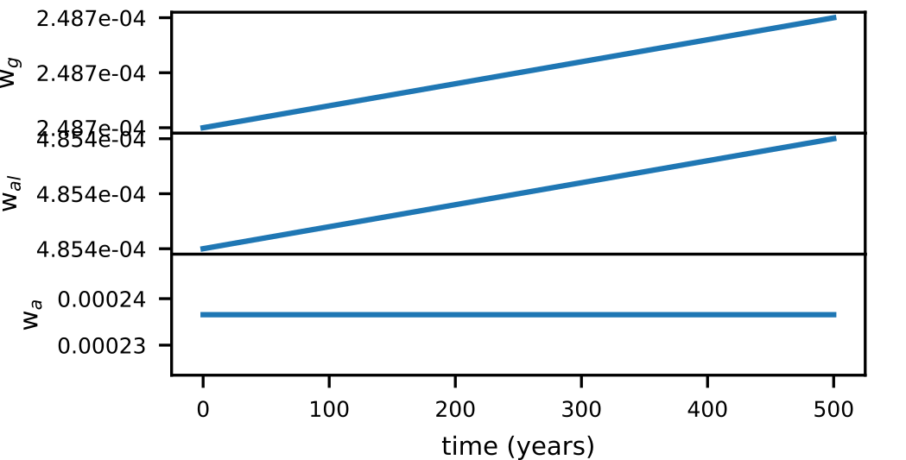

---                         
layout: default                                                                                     
title: Week 1                                                                          
parent: October 2023                                                                              
nav_order: 1                                                                                       
---

| Goal | Notes |                                                                                    
| ----------- | ----------- |                                                                       
|(W)|Introduce corrections by Heather |
|(PH)|Weather model; talk to jason|                                                
|(R)|lambda switch, paper review|                                                   
|(Code)|airports code, weather model|
|(O)|Think of group meeting|                                                       
                                              

##October 2

**M** Meeting with Heather

-Clarify the meaning of per-capita
-Mention explicitly what the tipping points are?
-How would you highlight the use of this method.
-Discussion: maybe be more explicit about how to use the PerCapFiniT protocol.
-Inconsisten use of terms: Simplified model, tipping points/critical concentrations,

**code** Ashwin weather model

According to what Toni and I discussed yesterday, I should do the following:

1. Run model with one equation, eq 4.1. You should get the figure 7.a                               
2. Do percapfinit analysis and identify closest mechanism to inactivation. With a timescale of 100 y
ears. Threshold should be 1 degree (or something like that) over 100 years.                         
3. Plot weights over time.                                                                          
4. Speculate that if that mechanism changed (or the temperature did) whatever would happen.

I have not gotten the figure 7.a., but I am not sure if I am doing the right thing. It is for sure true that I have gotten the equilibrium concentration. Should I do the percapita analysis now?
Or should I move on with the second model where the parameters change?
Well, for sure I will need to do both, so I can start with the weight analysis. It is probably true that I will see different weights even if the system is in the equilibrium.

In any case, the paper confirms me that the figure 7 corresponds to table 2, where parameters appear to change over time.
I've changed the structure of the parameters to make the function of the processes work. But it does not work because it was very tailored to the lotka-volterra system.

For now, I will label the terms by the exponent of the temperature.

check weights after break.

I should plot the weights separetely now. The weights barely change, because the temperature does not change either, of course.

Now, for lambda, I am going to assume rho=1 for now.
I will change the values of the parameters by lambda. At least in the first case.

This is getting to a point where I should write down carefully what I am doing. Otherwise, things will get confusing and I will have to go back to understand what I was doing.

1. I should start rewriting the equations in their original form.
2. Then I should write the lambda equation and write the whole thing as a two state variable system.
3. Then I should make the calculations to get a2 as a function of b2 (I guess)
4. Then rewrite the equations with b2 and a2 as functions of lambda (which really they are)
5. Then I should do some things to the code: add some comments and maybe put figures nicely.

I realized that none of my code for the L-V is actually reusable. It is recyclable, in the sense that I can copy-paste lines of code and tweak them, but I cannot really use the same functions because they are not general enough. I did my best at the time, but can I know think of the things I would do differently while coding?

$$\begin{equation}
\frac{dT}{dt}=-e_{SA} \sigma T^4 + \frac{\mu I_0 b_2}{4}a_2 T^2 +  \frac{I_0 \mu}{4} - \frac{\mu I_0}{4}a_2
\end{equation}$$

## October 2

**M** Meeting with Jason
Ecology laws/postulates.

## October 3

## October 4

**code** Ashwin model

$$\begin{equation}
\frac{dT}{dt}= \underbrace{\frac{e_{SA} \sigma}{c}}_{a} \bigg[ -T^4 + \underbrace{\frac{\mu I_0 b_2}{4 e_{SA} \sigma}}_{b_{\mu}} T^2 + \underbrace{\frac{\mu I_0}{4 c}(1 - a_2)}_{-d_{\mu}} \bigg]
\end{equation}$$

With time dependent parameters:

$$\begin{eqnarray}
\frac{dT}{dt} &=& \underbrace{\frac{e_{SA} \sigma}{c}}_{a} \bigg[ -T^4 + \underbrace{\frac{\mu I_0 b_2}{4 e_{SA} \sigma}}_{b_{\mu}} T^2 + \underbrace{\frac{\mu I_0}{4 c}(1 - a_2)}_{-d_{\mu}} \\
\frac{d \lambda}{dt} &=& \rho \lambda (1 - \lambda)
\end{eqnarray}$$

## October 5

**code** Ashwin model

### Model

The weather model provided in [Ashwin et al, 2012](https://www.jstor.org/stable/41348437) is:

$$\begin{equation}
c\frac{dT}{dt}= R_{\downarrow} - R_{\uparrow} \,
\end{equation}$$

with $$R_{\downarrow}=\frac{\mu I_0}{4}(1- \alpha_p(T)$$ and $$R_{\downarrow}=e_{SA} \sigma T^4$$ representing the incoming and outcoming radiation, respectively. $$\alpha_p(T)$$  represents the planet's albedo given by:

$$\begin{equation}
\alpha_p(T)=a_2 - b_2 T^2
\end{equation}$$

This gives a system that consists of three mechanisms, where we put together the two mechanisms that are temperature independent:

$$\begin{equation}
\frac{dT}{dt}= \underbrace{\frac{e_{SA} \sigma}{c}}_{a} \bigg[ -T^4 + \underbrace{\frac{\mu I_0 b_2}{4 e_{SA} \sigma}}_{b_{\mu}} T^2 + \underbrace{\frac{\mu I_0}{4 c}(1 - a_2)}_{-d_{\mu}} \bigg]
\end{equation}$$

Doing:

$$\begin{align}
a=\frac{e_{SA} \sigma}{c} & b_{\mu}=\frac{\mu I_0 b_2}{4 e_{SA} \sigma} & -d_{\mu}=\frac{\mu I_0}{4 c}(1 - a_2) \,
\end{align}

we get:

$$\begin{equation}
\frac{dT}{dt}= a \bigg[ \underbrace{-T^{4}}_{reflectivity} + \underbrace{b_{\mu} T^{2}}_{albedo loss} + \underbrace{-d_{\mu}}_{albedo} \bigg]
\end{equation}$$

### Equilibrium analysis

This system has two equilibrium states, given by the solution of $$\frac{dT}{dt}=0$$:

$$\begin{equation}
\underbrace{T^4}_{t^2} - b_{\mu} \underbrace{T^2}_{t} - d_{\mu}=0
\end{equation}$$

This gives:
$$\begin{equation}
T^{\pm}=\bigg(\frac{b_{\mu} \pm \sqrt{b^2_{\mu} - 4}}{2}\bigg)^{1/2}
\end{equation}$$

There is a saddle-node bifurcation for this system where T$$^+$$ and T$$^-$$ at $$\mu \sim 0.249$$

We implement the model in with the parameters and initial temperature $$T_0=290 K$$ given in the paper:

The system behaves as if it were in the equilibrium. We test  $$T_0=420 K >T^{+}$$:

We try a higher order of magnitude and we notice some changes at $$T_0=5000 K >>T^{+}$$:

### PerCapFiniT analysis

In this case, we are looking at a critical threshold of an increment of 1 K relative to the initial temperature over a timescale $$\tau=100$$ years. This means the per capita part of the analysis does not apply here: we are looking at an absolute change rather relative (think of the 1.5 C climate goal. Also, think of how this would change if you think in terms of Fahrenheit). So if we set a relevant timescale we get:

$$\begin{equation}
\tau \frac{dT}{dt}= \tau a \bigg[ \underbrace{-T^{4}}_{reflectivity} + \underbrace{b_{\mu} T^{2}}_{\text{albedo loss}} + \underbrace{-d_{\mu}}_{albedo} \bigg]
\end{equation}$$

This gives the following weights:

$$\begin{align}
w_{r}=\tau a T^4 && w_{al}=\tau a b_{\mu} T^{2} && w_{a}=d_{\mu}
\end{align}$$

These magnitudes represent the increment in temperature due to the respective processes over the relevant timescale. For the values of the parameters and $$T_0=290 K$$ given in the paper these give:

$$\begin{align}
w_{r}=2.49e-4 K && w_{al}=4.85e-4 K && w_{a}=2.37e-4 K
\end{align}$$

We now look at the critical temperatures at which the reflectivity and albedo loss contribute 1 K to the system over a relevant timescale $$\tau$$:

$$\begin{align}
T^{c}_{r}=\frac{1}{(\tau a)^{1/4}}=2309.4 K && T^{c}_{al}=\frac{1}{(\tau b_{\mu})^{1/2} } = 13163.2 K
\end{align}$$

The weight analysis for this system for the conditions explained above gave:

As expected, the weights are practically constant and any changes happen beyound the 6th decimal position.

### R-Tipping point analysis

Now the parameters change according to a dimensionless parameter $$\lambda$$. $$lambda$$ changes dynamically as:

$$\begin{equation}
\frac{d\lambda}{dt}=\rho \lambda(1-\lambda)
\end{equation}$$

The solution to this differential equation gives:

$$\begin{equation}
\lambda(t)=\frac{\frac{\lambda_0}{1-\lambda_0}e^{\rho t}}{1 + \frac{\lambda_0}{1-\lambda_0} e^{\rho t}}
\end{equation}$$

$$\lambda$$ decays very fast in time for $$\rho=0.18$$.

$$b_2$$ changes over time through lambda as:

$$\begin{equation}
b_{2}=(1-\lambda)b^{init}_2 + \lambda b^{final}_2 \,
\end{equation}$$

For the values in the paper, $$b_2$$ is:

This is clearly not consistent with the paper; for $$b_2(t=0)=b^{init}_2$$, $$\lambda(t=0)=0$$, which is clearly not the case. Given its mathematical expression, that would render $$\lambda$$ constant.

with $$b^{init}_{2}=1.690 \cdot 10^{-5}$$ K$$^{-2}$$ and $$b^{final}_2=1.835 \cdot 10^{-5}$$ K$$^{-2}$$.
$$a_2$$ changes so that $$A=b^{2}_{\mu} - 4 d_{\mu}$$ remains constant. I do not understand what this means yet.

However, we can rewrite the system as:

$$\begin{align}
\frac{dT}{dt} &=& a \bigg[ \underbrace{-T^{4}}_{reflectivity} + \underbrace{b_{\mu} T^{2}}_{albedo loss} + \underbrace{-d_{\mu}}_{albedo} \bigg] \\
\frac{d\lambda}{dt} &=& \rho \lambda(1-\lambda)
\end{align}$$

Decomposing some parameters:

First attempt:
$$\begin{align}
\frac{dT}{dt} &=& a \bigg[ \underbrace{-T^{4}}_{reflectivity} + \underbrace{\frac{\mu I_0}{4 e_{SA}}  b_{2} T^{2}}_{albedo loss} + \underbrace{ \frac{\mu I_0}{4 c} (1 - a_2)}_{albedo} \bigg] \\
\frac{d\lambda}{dt} &=& \rho \lambda(1-\lambda)
\end{align}$$

$$\begin{align}
\frac{dT}{dt} &=& a \bigg[ \underbrace{-T^{4}}_{reflectivity} + \underbrace{\frac{\mu I_0}{4 e_{SA}} b_{2} T^{2}}_{albedo loss} + \underbrace{ \frac{\mu I_0}{4 c} (a_{2} -1)}_{albedo} \bigg] \\
\frac{d\lambda}{dt}=\rho \lambda( 1-\lambda )
\end{align}$$

For $$b_2$$, we get:

$$\begin{align}
\frac{dT}{dt} &=& a \bigg[ \underbrace{-T^{4}}_{reflectivity} + \underbrace{\frac{\mu I_0}{4 e_{SA} (1-\lambda)b^{init}_2 + \lambda b^{final}_2 T^{2}}_{\text{albedo loss}} + \underbrace{\frac{\mu I_0}{4 c}(a_2 -1)}_{albedo} \bigg] \\
\frac{d\lambda}{dt}=\rho \lambda(1-\lambda)
\end{align}$$

### Possible solutions for the problem

1. Kick the parameters a$$_2$$ and b$$_2$$ out of their initial values to the final values and see what happens:

## October 6

**O** Zoom meeting logistics
I've realized I have two meetings: my personal zoom room, and a recurring biomath session. I need to be careful with that in the future.

**code** Possible fast solutions for the problem. Kick the system parameters from initial value to final value.

I am going to do a model that I am going to call 'kick'. I am just going to change the name of the parameters.