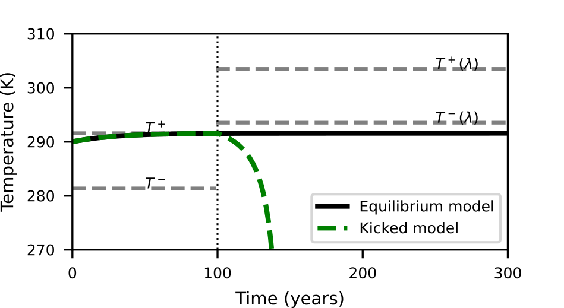

---                         
layout: default                                                                                     
title: Week 2
parent: October 2023                                                                              
nav_order: 2                                                                                      
---

| Goal | Notes |                                                                                    
| ----------- | ----------- |                                                                       
|(W)||
|(PH)|Finish weather model|                                                
|(R)|paper review, Jason's papers| 
|(Code)|airports code, weather model|
|(O)|Think of group meeting|                                                       
                                              
##October 9

**R** Review paper SBMs

I had forgotten most of this paper, but I will resume it where I had left it.
They propose something called Bayesian-SBM-MRF.
Instead of a multinomial prior they use an MRF prior. This MRF prior can incorporate information about a given taxonomic tree on microbiome community detection. MRF is a class of parameteric models for spatial data analysis. Nearest neighbor problem.
Calculating the conditional probability that a taxon j belongs to community k given all neighboring taxa.
Two taxa belongin to the same community are paired in the same block.

MOdel Fitting
They usee a Gibbs sampler.
Posterior inference of the parameters of main interest \Omega and z.
They will say how to select the number of communities.

**O** Group meeting.

1. Dynamical systems are those that change significantly over time. Ecology is an example of that.
2. We need dynamical models to study those systems. Differential equations (rates).
3. We owe that to Newton and Leibniz. They introduce 'motion' in math.
4. What we are interested in the case of these models is to predict transient dynamics and the tipping points producing them.
5. The probel here is that most methods are based on asymptotic analysis, where the first step is to look for equilibrium and stability. These methods assume that the behavior of systems is not going to change on a very long timescale.
6. This is true at cosmological/geological timescales, but not on ecological scales.
7. That is why we need a method to predict these tipping points.
8. The problem in these models is that humans are not great at understanding non-linear systems. Essentially, in linear systems things change at a constant rate.
9. And transient dynamics are non-linear phenomena. Tipping points trigger changes in the dynamics of the system.
10. So anyway, our hypothesis is that, given a dynamical system, not all mechanisms are active all the time.
11. In a dynamical model, you explicitly model all the mechanisms that you hypothesize are going to be important (at any given time). And we think that is the problem. Some mechanisms are rarely active. But when they are or they become active, things will change dramatically.
12. How we do this? Let's consider this example first.
13. Then, what we lay down the conditions for a mechanism to become active/inactive:
    13.1. Set a relevant timescale.
    13.2. Set a significant change over that timescale.

14. This is something we can implement mathematically.

**code** Weather model

Issues:

1. The model in the equilibrium does not replicate the behavior in the paper in my machine. This is extremely strange, because I do get the same equilibrium concentrations. Typically, that means that:
   a. On paper, I got the model correctly.
   b. The values of the parameter are correct. At least those that show up in the equilibrium concentrations. There must be an error in the implementation of the model, but I am not seeing it. This error could be living in the parameter 'a'.

Ideas:
-Check the implementation of the model carefully. Does everything make sense?
-Check the parameter 'a' carefully. Does it make sense?
-Try the value of the parameter in the Sutera paper and see what happens.
-Start the model from the equilibrium concentrations.

I tried setting the temperature to zero and one and calculate the rates manually. Although this difficult to narrow down, the numbers make sense.

Ok, it works now.
What should I focus on now? probably recalculating the weigths with the information I have.

2. I still don't know how to model a2 as a function of bmu- 4dmu (or whatever)

3. I do not know how to kick the model linearly.
Idea:
 -Think of a third model in which parameters change linearly over time (they don't have to be the same values. Implement that model as a separate equation. Your strategy should be that the parameterschange inside the model. I don't see any other way around.
 
 -Think of an equation that goes from 0 to 1 (hill function?) and scale it to be constrained between the minimum and a maximum value.

## October 10

**R** Paper Review
z: vector of community labels for each taxa
\Omega: edge probability matrix (SBM matrix?)
\omega_{k, k'}: edge probabilites within (k'=k) and between (k'!=k) any two taxa
\tau: genus label

Instead of a multinomial prior they use an MRF prior. This MRF prior can incorporate information about a given taxonomic tree on microbiome community detection. MRF is a class of parameteric models for spatial data analysis. Nearest neighbor problem.

A two-step Gibbs sampler
I don't understand the algorithm.
Three inferences:
1. Edge probabilities so that they can assess the relationship of all taxa within and between the communities.
2. Identify the community labels of all the taxa given by the parameter z
3. Optimal value of K to estimate the appropriate number of communities.

Go tomorrow for the real data analysis 1

## October 11

**code** Ashwin model

The weather model provided in [Ashwin et al, 2012](https://www.jstor.org/stable/41348437) is:       
                                                                                                    
$$\begin{equation}                                                                                  
c\frac{dT}{dt}= R_{\downarrow} - R_{\uparrow} \,                                                    
\end{equation}$$                                                                                    
                                                                                                    
with $$R_{\downarrow}=\frac{\mu I_0}{4}(1- \alpha_p(T))$$ and $$R_{\uparrow}=e_{SA} \sigma T^4$$
representing the incoming and outcoming radiation, respectively. $$\alpha_p(T)$$  represents the
planet's albedo given by:       

$$\begin{equation}
\alpha_p(T)=a_2 - b_2 T^2
\end{equation}$$

This gives a system that consists of three mechanisms, where we put together the two mechanisms that are temperature independent:

$$\begin{equation}
\frac{dT}{dt}= \underbrace{\frac{e_{SA} \sigma}{c}}_{a} \bigg[ -T^4 + \underbrace{\frac{\mu I_0 b_2}{4 e_{SA} \sigma}}_{b_{\mu}} T^2 + \underbrace{\frac{\mu I_0}{4 e_{SA} \sigma}(1 - a_2)}_{-d_{\mu}}
\bigg] \, .
\end{equation}$$

Considering

$$\begin{align}
a=\frac{e_{SA} \sigma}{c} && b_{\mu}=\frac{\mu I_0 b_2}{4 e_{SA} \sigma} & -d_{\mu}=\frac{\mu I_0}{4e_{SA} \sigma}(1 - a_2) \, ,
\end{align}$$

we get:

$$\begin{equation}
\frac{dT}{dt}= a \bigg[ \underbrace{-T^{4}}_{reflectivity} + \underbrace{b_{\mu} T^{2}}_{albedo loss} + \underbrace{-d_{\mu}}_{albedo} \bigg]
\end{equation}$$

The value of $$a$$ provided in [Ashwin et al, 2012](https://www.jstor.org/stable/41348437) is wrong and its original value is $$a=1.132 \cdot 10^{-8}$$ K$$^4$$.

### Equilibrium analysis

This system has two equilibrium states, given by the solution of $$\frac{dT}{dt}=0$$:

$$\begin{equation}
\underbrace{T^4}_{t^2} - b_{\mu} \underbrace{T^2}_{t} - d_{\mu}=0
\end{equation}$$

This gives:

$$\begin{equation}
T^{\pm}=\bigg(\frac{b_{\mu} \pm \sqrt{b^2_{\mu} - 4}}{2}\bigg)^{1/2}
\end{equation}$$

In this system $$T^{+}=291.56$$ an $$T^{-}=281.34$$.

There is a saddle-node bifurcation where T$$^+$$ and T$$^-$$ at $$\mu \sim 0.249$$.

### PerCapFiniT analysis

In this case, we are looking at a critical threshold of an increment of 1 K relative to the initial
temperature over a timescale $$\tau=100$$ years. This means the per capita part of the analysis
does not apply here: we are looking at an absolute rather than a relative change. So if we set a relevant timescale we get:

$$\begin{equation}
\tau \frac{dT}{dt}= \tau a \bigg[ \underbrace{-T^{4}}_{reflectivity} +\underbrace{b_{\mu} T^{2}}_{\text{albedo loss}} + \underbrace{-d_{\mu}}_{albedo} \bigg]
\end{equation}$$

### Change in parameters

We implement a simplified version of this model where the values of the parameters instantaneously change from $$a_0 = 1.6927$$ and $$b_0 = 1.69e-5$$ K$$^{-2}$$ to $$a_f= 1.8168$$  and $$b_f= 1.835e-5$$ K$$^{-2}$$.

We implement the model in with the parameters and initial temperature $$T_0=290 K$$ given in the paper:

