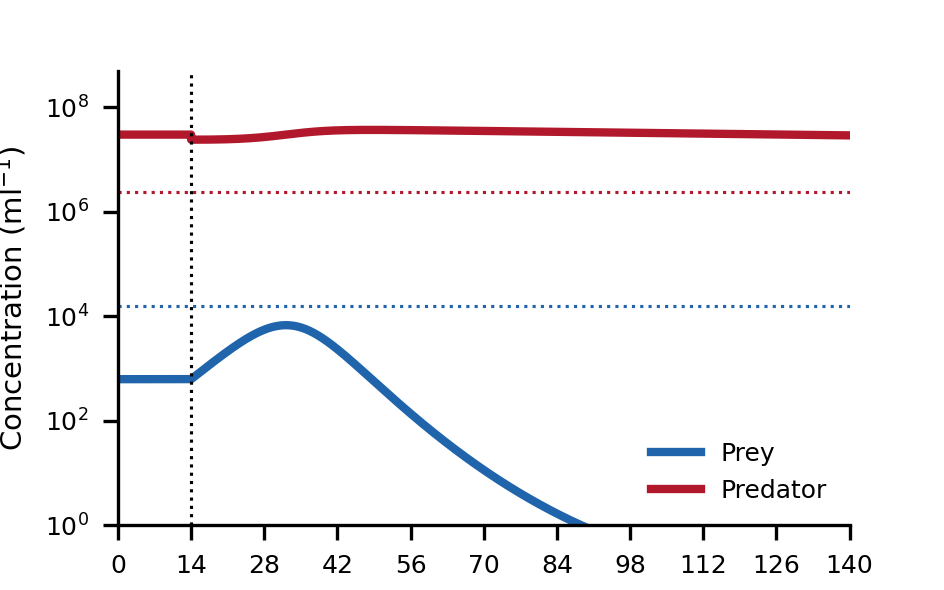
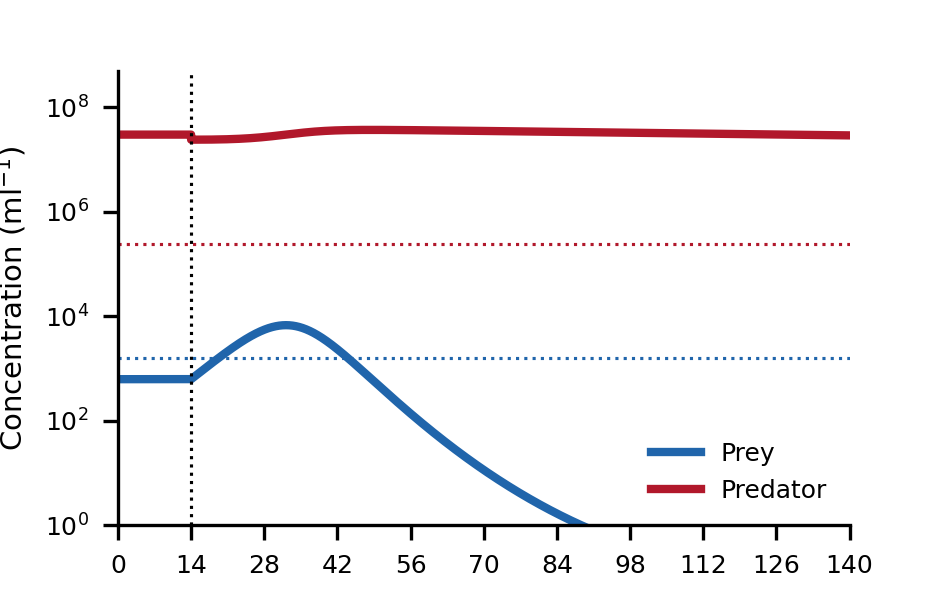

| Goal | Notes |
| ----------- | ----------- |
|(W)| |
|(PH)| |
|(R)| |
|(Code)| |
|(O)| |

## October 30

**R** Paper: Warming effects on marine microbial food web processes: how far can we go when it comes to predictions?

The paper studies the effect of global warming on the microbial marine life.
The results show that temperature increases Bacterial respiration, bacterial losses due to grazers, and bacterial-grazer biomass flux.
Warming also increases Bacterial production.

## October 31

**PH** I went back to the GoldSim metabolic machine modeling and realized there were a few errors that I corrected. I am a little bit hesitant about the respiration power, but I at least have a source now.

## November 1

**W** I finished the table of dynamics now. I just need to correct it into latex form and add the text. I think I can do that tomorrow and now correct the figure of the supplementary.

## November 2

**W** I did a prototype of a latex table for the stability analysis. It took me more time than I had expected

## November 3

**R** Linux book
Linux has three levels: the kernel sits at the intermediate level

**R** Warming effects on marine microbial food web processes: how far can we go when it comes to predictions?w
Euphotic-illuminated
In the euphotic layer of the ocean, the Sun supports a huge photosynthetic activity. Half of the primary production on Earth takes place in the ocean and it is microbial.
The microbial food can be divided into functional boxes instead of species or different phylogenetic levels.

**W** I am going to read the resilience analysis and think of what it's wrong.

Here's what I need to do if I want to lable a table as Table SN, where N is the number of the table.

First of all, I need to use \begin{center} and \end{center} wrapping the table. That allows me captioning the table. But when I caption the table, I do not have any control of the number of the table. I need to go deeper into latex to be able to do that. So I renew a command of table like this:

    \renewcommand{\thetable}{S\arabic{table}}

This is telling latex that it should number the tables putting an S in fron of it. Now, could I do this only at the beginning of the supplementary materials? Yes, that works. Let's see what happens if I have a table in the main text. Yes, that was the right thing to do.

It seems that \begin{center} really does center the text and not that much. I imagine I could caption the table but the text would not be centered.

I want to know if what we say about the resilience analysis is true.

**O** Resilience analysis:

"In the Growth-on-decay-off scenario, the phage population recovered after a perturbation while the bacterial population became extinct for a finite volume (Figure \ref{fig:resilience} a). This was consistent with a stable equilibrium expected for a model without the decay term (Table S1). The discrepancy of 0.03\% was due to the inactivation of the predation term."

It is true that the conditions observed are consistent with the equilibria of any regime with decay inactive.
It is not clear why the system had been in the equilibrium before kicking it. However, the kick might activate/inactivate certain mechanisms. Let's take a look:

The initial conditions for the simulation are:
$$B_0=622$$ cells/ml and $$P_0=3e7$$ phages/ml
The final values are:
$$B_f=1.62e-01$$ cells/ml $$P_f=2.90e+07$$ phages/ml

The minimum and maximum values for each state variable are:
$$P_{min}=2.4e7$$ phages/ml $$P_{max}=3.7e7$$ phages/ml
$$B_{min}=0.13$$ cells/ml $$B_{max}=6732.71$$ cells/ml

Let's assume that $$\tau=14$$ h, which then means $$B_c=15900$$ cells/ml and $$P_c=2.38e6$$ phages/ml. In that case, the bacterial concentration never reaches $$B_c$$ and the phages never drop below $$P_c$$. The only processes active are growth and predation. From this perspective, the reason why the phage does not recover to its initial concentration $$P_0$$ is because the decay is marginally active.

  

If we assume that $$\tau=140$$ h, then $$B_c=1587$$ cells/ml and $$P_c=2.38e6$$ phages/ml. In that case, the burst is activated over a short period of time.

  

Both cases are consistent with only growth and predation being active all the time and us getting the approximate equilibrium concentrations observed.
